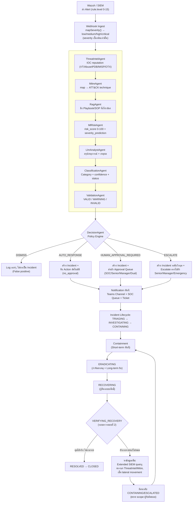

# Incident Response Workflow — SOAR Platform

> **Update 2026-09-25 — Severity is the primary classification; Risk Score is retired from decisions.**
> Policy now evaluates the incident **severity** (analyst-validated) plus asset criticality and action impact.
> The risk-score rules (RULE-R01..R04, RULE-P08, RULE-P10) are disabled (rows kept for history), the engine never
> matches a `riskScore` condition, and no risk score is produced, sent or displayed. Canonical rules:
> `apps/backend/prisma/seeds/policy.seed.ts`. Statements about risk score / risk level below are historical.

เอกสารนี้อธิบาย **Flow การจัดการ Incident แบบ end-to-end** ของแพลตฟอร์ม ตั้งแต่ Wazuh ยิง
alert เข้ามา จนถึงปิดเคส โดยอ้างอิงจากโค้ดจริงที่มีอยู่แล้วในระบบ (ไม่ใช่การออกแบบใหม่ทั้งหมด)
เพื่อให้ทีม SOC / IR / Manager ใช้เป็นเอกสารอ้างอิงเดียวกันได้

อ้างอิงโค้ดหลัก:
- Wazuh → severity เบื้องต้น: [WazuhAdapter.ts](../../apps/backend/src/infrastructure/external-services/siem/WazuhAdapter.ts)
- Incident lifecycle (state machine): [Incident.entity.ts](../../apps/backend/src/domain/incident/entities/Incident.entity.ts)
- AI pipeline (9 agents, LangGraph): `apps/ai-orchestrator/src/agents/*`
- การตัดสินใจ/policy: [decision_agent/models.py](../../apps/ai-orchestrator/src/agents/decision_agent/models.py), [action_catalog.py](../../apps/ai-orchestrator/src/agents/decision_agent/action_catalog.py)
- การ classify: [contracts/classification.py](../../apps/ai-orchestrator/src/contracts/classification.py)
- การแจ้งเตือน/ส่งต่อ: [orchestrator-callback.webhook.ts](../../apps/backend/src/presentation/http/webhooks/orchestrator-callback.webhook.ts), `automation/n8n/workflows/`

---

## 1. วัตถุประสงค์และขอบเขต (Objective & Scope)

**วัตถุประสงค์**
- ให้ Wazuh (หรือ SIEM อื่น) ทำหน้าที่เป็น **แหล่ง Detection** เท่านั้น — ไม่ใช่ผู้ตัดสินความรุนแรงสุดท้าย
- ให้ระบบ AI pipeline ประเมิน **Classification + Risk/Severity ใหม่** จากหลายแหล่งข้อมูลก่อนส่งต่อให้คน
- ให้ทุก Incident มี **เจ้าของ/ผู้อนุมัติที่ชัดเจนในแต่ละขั้น** (SOC → IR → Manager)
- ให้ทุก Incident ผ่าน **การ verify 2 รอบ** ก่อนปิดเคส (รอบแรกตอนตัดสินใจ, รอบสองตอนยืนยันว่าคุมได้จริง)

**ขอบเขต (In-scope)**
- Alert ingestion (Wazuh webhook) → AI pipeline (9 agents) → Decision → Approval →
  Containment/Eradication/Recovery → Verification → Close
- การแจ้งเตือนผ่าน Teams / SOC queue / Ticketing (n8n)

**นอกขอบเขต (Out-of-scope)**
- การปรับจูน Wazuh rule/decoder เอง (สมมติว่า Wazuh ส่ง alert ที่ผ่าน rule แล้ว)
- การสอบสวนเชิงกฎหมาย/HR ของ Insider Threat (ส่งต่อให้ทีม Legal/HR ภายนอกระบบ)
- การ execute จริงระดับ EDR/Firewall (อยู่ใน "Automation Controller" ซึ่งเป็นเฟสถัดไป — วันนี้ระบบให้แค่ *recommendation* ไม่ใช่คำสั่งบังคับ)

---

## 2. Flow รวม (End-to-End)

**สรุปแนวคิดสำคัญ**: `Alert ≠ Incident ≠ Response Action ≠ Recovery ≠ Resolution` — แต่ละคำมี
สถานะและเจ้าของของตัวเอง ไม่ใช่การ mark เสร็จแล้วจบ (ดูหมายเหตุใน `Incident.entity.ts` บรรทัด 33-44)

---

## 3. เกณฑ์การ Classify — กำหนดชัดเจนเป็น 2 ชั้น

### 3.1 ชั้นที่ 1 — Severity เบื้องต้นจาก Wazuh (สัญญาณตั้งต้น ไม่ใช่ค่าสุดท้าย)

| Wazuh `rule.level` | Severity เบื้องต้น |
|---|---|
| 14–15 | critical |
| 11–13 | high |
| 7–10 | medium |
| 0–6 | low |

### 3.2 ชั้นที่ 2 — Classification Category (ClassificationAgent)

Taxonomy คงที่ 11 หมวด (ไม่สร้างหมวดใหม่เอาเองต่อ alert — ถ้าไม่เข้าเกณฑ์ใดเลยให้เป็น `UNKNOWN`):

`BRUTE_FORCE` · `PHISHING` · `RANSOMWARE` · `MALWARE` · `DATA_EXFILTRATION` ·
`INSIDER_THREAT` · `CREDENTIAL_ATTACK` · `ACCOUNT_COMPROMISE` ·
`COMMAND_AND_CONTROL` · `INITIAL_ACCESS` · `UNKNOWN`

แต่ละ classification มาพร้อม **status ความมั่นใจ** 4 ระดับ:

| Status | ความหมาย | ผลต่อ Flow |
|---|---|---|
| `HIGH_CONFIDENCE` | หลักฐานสอดคล้องหลายแหล่ง (MITRE + ThreatIntel + ML + RAG) | ไปต่อ policy ปกติ |
| `MEDIUM_CONFIDENCE` | หลักฐานสนับสนุนบางส่วน | ยังไปต่อได้ แต่ ValidationAgent อาจ WARNING |
| `LOW_CONFIDENCE` | หลักฐานน้อย/ขัดแย้งกัน | บังคับ human review เพิ่ม |
| `UNCLASSIFIED` | ไม่มีหลักฐานเพียงพอเลย | ไม่ auto-response แม้ Wazuh severity สูง |

### 3.3 ชั้นสุดท้าย — Risk/Severity ที่ระบบประเมินเอง (MlRiskAgent)

`risk_score` (0–100) + `severity_prediction` (`low/medium/high/critical`) คำนวณจากหลาย
feature (ไม่ใช่แค่ rule.level) — ดูหัวข้อ 8

---

## 4. บทบาทและผู้รับผิดชอบ (RACI)

| บทบาท | ใครทำหน้าที่นี้ | Approval Tier ที่ผูกอยู่ | หน้าที่หลัก |
|---|---|---|---|
| **SOC Tier-1 Analyst** | เวรแรกที่รับ alert | `soc_analyst_approval` (queue: `soc-tier1-approval-queue`, SLA 15 นาที) | Validate เบื้องต้น, อนุมัติ action ความเสี่ยงต่ำ-กลาง (block IP, disable account, kill process) |
| **Senior Analyst** | ทีม IR ระดับ 2 | `senior_analyst_approval` | รับ escalate จาก Tier-1 ที่ timeout/severity สูงขึ้น, ตัดสินกรณีหลักฐานขัดแย้ง (`ValidationAgent` = WARNING/INVALID) |
| **Incident Response (IR) Lead** | ผู้นำทีม IR | ผสมทั้ง `senior_analyst_approval` และ `manager_approval` | คุม containment/eradication/recovery ทั้งกระบวนการ, ตัดสินใจ long-term fix |
| **Manager / IR Manager** | หัวหน้าฝ่าย Security | `manager_approval`, `dual_approval` (คู่กับ IR Lead) | อนุมัติ action ที่กระทบธุรกิจ (เช่น re-enable account หลังกู้คืน — `REC-004`), อนุมัติกรณี `business_policy_tags` = sensitive/regulated |
| **CISO / Emergency Approver** | ผู้บริหารระดับสูง | `emergency_approval` | เฉพาะกรณี Emergency Override policy เท่านั้น (ransomware ระดับวิกฤต, ต้องตัดระบบธุรกิจ) |
| **Automation Controller (ระบบ)** | ไม่ใช่คน — ตัว engine | ทำงานตาม `execution_mode` (`automatic`/`semi_automatic`) | รัน action ที่ผ่านการอนุมัติแล้วเท่านั้น — ไม่มีสิทธิ์ตัดสินใจเอง |

**ใครเป็นผู้ Validate อะไร** (มาจาก `ValidationAgent` — ตรวจสอบเชิงตรรกะ ไม่ใช่คนกดอนุมัติ):
1. Risk score กับ severity label ตรงกันหรือไม่ (`risk_internal_consistency`)
2. Severity สูงแต่ confidence ต่ำ → ต้อง flag ให้คนดู (`confidence_sanity`)
3. MITRE technique confidence ต่ำเกินไปหรือไม่ (`mitre_confidence`)
4. IOC ถูก enrich ได้จริงหรือไม่ (`ioc_enrichment`)
5. คำตอบของ LLM สอดคล้องกับหลักฐานจริงหรือไม่ (`llm_consistency`)

ผลลัพธ์ `INVALID` → DecisionAgent จะ **fail-safe ไป human_approval เสมอ** ไม่ปล่อยให้ auto-response
(ดู `_fail_safe_result` ใน `decision_agent/agent.py`)

---

## 5. ช่องทางส่งต่อ Alert / Escalation

| ช่องทาง | ใช้ตอนไหน | Action/Workflow อ้างอิง |
|---|---|---|
| **SOC Analyst Queue** (in-app) | ทุก incident ที่ไม่ dismiss | `NOTIF-001 SOC Analyst Queue Alert` |
| **Microsoft Teams channel** | แจ้งทีมแบบเรียลไทม์ | `NOTIF-003 Team Channel Alert` → n8n `teams-notification.json` |
| **Ticketing system** | เปิดเคสให้ติดตามงาน | `create-investigation-ticket` action → n8n `ticket-creation.json` |
| **Escalation อัตโนมัติ (timeout)** | ไม่มีคนตอบภายใน SLA | `timeout_fallback` เช่น `escalate_to_senior_analyst_approval` |
| **Email** | ⚠️ ระบุไว้ใน spec (`automation/n8n/workflows/README.md`) แต่ **ยังไม่ implement จริง** (`email-notification.json` ยังไม่มีไฟล์) — เป็น gap ที่ต้องเติมถ้าต้องการ | ต้องสร้าง workflow ใหม่ |

> Escalation เป็นทางเดียว (one-directional) เท่านั้น — ไม่มีการลด tier ระหว่างทาง
> (`stricter_approval_tier()` บังคับไว้ในโค้ด)

---

## 6. Containment: Short-term vs Long-term

| ประเภท | เป้าหมาย | ตัวอย่าง Action ในระบบ | Reversible? |
|---|---|---|---|
| **Short-term (ทันที/ชั่วคราว)** | หยุดความเสียหายตอนนี้ ไม่รอ root cause | `CONT-001` Host Network Isolation, `CONT-004` Quarantine File, `NET-001/002` Block IP/Domain, `EP-002` Kill Process | ส่วนใหญ่ Yes — rollback ได้ |
| **Long-term (แก้ไขถาวร)** | ปิด root cause ไม่ให้เกิดซ้ำ | `CRED-003` Disable Account + reset นโยบายรหัสผ่าน, patch ช่องโหว่ที่ถูกใช้โจมตี, ปรับ DLP/Firewall policy, `REC-004` Re-enable แบบมีเงื่อนไข (ต้อง Manager approval) | บางส่วนกลับได้ (Partial/Yes) |

กฎการเลือก: **เริ่ม short-term ก่อนเสมอ** เพื่อหยุดเลือดไหลตาม SLA แล้วค่อยวางแผน long-term
ระหว่าง `ERADICATING` ก่อนเข้า `RECOVERING`

---

## 7. Verify รอบที่ 2 (`VERIFYING_RECOVERY`)

หลัง `RECOVERING` เสร็จ ระบบ/ทีมต้อง**ตอบคำถามนี้ให้ได้ก่อนปิดเคส**:

> **"Incident นี้แก้ไขได้จริงแล้ว หรือกระจายไปเครื่อง/บัญชีอื่นแล้ว?"**

- ✅ **ถ้าคุมได้จริง (ไม่กระจาย)** → `VERIFYING_RECOVERY → RESOLVED → CLOSED`
  - ทำ: บันทึก MTTR, ปิด ticket, `REC-005 Validate and Close Incident`
- ❌ **ถ้ายังยับยั้งไม่ได้ / กระจายไปเครื่องอื่น** → **ห้ามปิดเคส** ต้อง:
  1. กลับสถานะ `RECOVERING → RECOVERING` (retry) หรือ `→ ESCALATED` ถ้าความรุนแรงเพิ่มขึ้น
  2. หาข้อมูลเพิ่มเติมว่าทำไมยังคุมไม่ได้ — เช่น
     - รัน `INV-002 Extended SIEM Log Query` ขยายช่วงเวลา/ขยาย scope host
     - เรียก `ThreatIntelAgent`/`MitreAgent` ใหม่กับ IOC ที่เจอเพิ่ม
     - ตรวจ lateral movement (เครื่องอื่นที่คุย network กับ host เดิม)
     - ตรวจว่า short-term containment หลุด (เช่น isolation ถูกปลด) หรือไม่
  3. ขยาย scope ผู้รับผิดชอบ (Senior Analyst → Manager) ตาม severity ที่ยกระดับ

`VALID_TRANSITIONS` ในโค้ดบังคับกฎนี้ตรงๆ: `VERIFYING_RECOVERY` ไปได้แค่ `RESOLVED` หรือย้อนกลับ
`RECOVERING` เท่านั้น — **ไม่มีทางลัดไป CLOSED โดยไม่ verify**

---

## 8. Wazuh = Detection เท่านั้น, Risk/Severity จริงมาจากหลายแหล่ง

Wazuh ให้แค่ `rule.level` (0–15) ซึ่งเป็นสัญญาณตั้งต้นจากกฎเดียว — ระบบ**ต้อง**ประเมินใหม่จาก:

| แหล่งข้อมูล | ให้ข้อมูลอะไร |
|---|---|
| `ThreatIntelAgent` | ชื่อเสียง IOC จริง (VirusTotal/AbuseIPDB/MISP/OTX) |
| `MitreAgent` | ผูกกับ ATT&CK technique + confidence ของการ match |
| `RagAgent` | เทียบกับ Playbook/Threat report ในอดีตว่าคล้ายเคสไหน |
| `MlRiskAgent` | คำนวณ `risk_score` (0-100) จาก feature หลายตัวรวมกัน ไม่ใช่แค่ rule level |
| `LlmAnalystAgent` | ให้เหตุผลเชิงบรรยาย + สอดคล้องกับหลักฐานหรือไม่ |
| `ClassificationAgent` | จัดหมวดหมู่ + ความมั่นใจ |
| `ValidationAgent` | เช็คว่าทุกอย่างข้างบนสอดคล้องกัน — ถ้า Wazuh บอก high แต่หลักฐานจริงบอก low (หรือกลับกัน) จะถูก flag |

**ผลลัพธ์**: Severity/Priority ที่ใช้จริงในการ route approval คือค่าจาก `EvidenceSummary`
(ของ `DecisionResult`) **ไม่ใช่** `rule.level` ดิบจาก Wazuh — ดูเคสที่ 8 และ 10 ในตารางถัดไป
ที่แสดงทั้งกรณี "Wazuh ประเมินต่ำเกินไป" และ "Wazuh ประเมินสูงเกินไป"

---

## 9. การแจ้งเตือนเมื่อกลายเป็น Incident แล้ว

จุดที่ระบบ "รู้" ว่า alert กลายเป็น incident แล้ว คือ `orchestrator-callback.webhook.ts` —
ทันทีที่ DecisionAgent ตัดสินใจ (ไม่ใช่ `dismiss`):

1. บันทึก audit event `decision_made` เสมอ (ทุกกรณี)
2. ถ้า `human_approval` → เปิด `Approval` request เข้า queue ของ tier ที่ถูกกำหนด
3. ถ้า `auto_response`/`escalate` → trigger generic playbook (`soar/playbook-run`) ซึ่งยิง
   Teams notification + สร้าง ticket ทันที
4. `dismiss` เท่านั้นที่**ไม่**สร้างการแจ้งเตือนออกไปนอกระบบ (log ไว้เป็น audit อย่างเดียว)

---

## 10. ตัวอย่าง 10 เคส (ครอบคลุมทุก Category / ทุกเส้นทาง Decision)

| # | สถานการณ์ | Wazuh Level → Severity เบื้องต้น | Classification (status) | ผลประเมินใหม่ (risk_score → severity) | Decision / Priority | Approval Tier | Containment | ผล Verify รอบ 2 |
|---|---|---|---|---|---|---|---|---|
| 1 | พยายาม login ผิดรัวๆ จาก IP เดียว | 8 → medium | `BRUTE_FORCE` (HIGH_CONFIDENCE) | 40 → medium | `auto_response` / P3 | no_approval | Short: `NET-001` block IP | คุมได้ → RESOLVED |
| 2 | อีเมลฟิชชิ่งพร้อมลิงก์ปลอม | 6 → medium | `PHISHING` (MEDIUM_CONFIDENCE) | 35 → medium | `human_approval` / P3 | SOC Tier-1 | Short: `NET-002` block URL; Long: `CRED-001` force reset | คุมได้ → CLOSED |
| 3 | พบไฟล์เข้ารหัสจำนวนมาก (ransomware) | 15 → critical | `RANSOMWARE` (HIGH_CONFIDENCE) | 95 → critical | `escalate` / P1 | Dual + Emergency | Short: `CONT-001` isolate host, `EP-006` forensic image; Long: rebuild + restore backup | **ไม่คุม** พบกระจาย 2 เครื่อง → กลับ `ESCALATED`, ขยาย scope investigation |
| 4 | Endpoint สื่อสารกับ C2 server | 10 → high | `COMMAND_AND_CONTROL` (HIGH_CONFIDENCE) | 70 → high | `human_approval` / P2 | Senior Analyst | Short: `NET-001` block C2 IP + `EP-002` kill process | คุมได้ → RESOLVED |
| 5 | Outbound transfer ข้อมูลปริมาณมากผิดปกติ | 12 → high | `DATA_EXFILTRATION` (MEDIUM_CONFIDENCE) | 80 → critical (ValidationAgent WARNING: ขัดแย้งเล็กน้อย) | `escalate` / P1 | Manager | Short: `CONT-001` isolate; Long: ทบทวน DLP policy | **ไม่คุมสมบูรณ์** — ยังมี exfil ผ่าน cloud app → หาข้อมูลเพิ่ม (extended query), ขยาย scope |
| 6 | AV ตรวจพบและ quarantine มัลแวร์อัตโนมัติ | 7 → medium | `MALWARE` (HIGH_CONFIDENCE) | 25 → low | `auto_response` / P4 | no_approval | Short: `CONT-004` quarantine file | คุมได้ทันที → CLOSED (auto) |
| 7 | พนักงานดึงข้อมูลลูกค้าปริมาณผิดปกตินอกเวลางาน | 9 → medium | `INSIDER_THREAT` (LOW_CONFIDENCE) | 45 → medium (confidence_sanity: WARNING) | `human_approval` / P2 | Senior + Manager (sensitive tag) | Short: จำกัดสิทธิ์เข้าถึงข้อมูล; Long: ส่งต่อ HR/Legal (นอกระบบ) | รอผลสอบสวนภายนอก — เคสค้างไว้ที่ `PENDING_APPROVAL` |
| 8 | Credential stuffing จาก IP กลุ่ม botnet ที่รู้จัก | 5 → low (Wazuh ประเมินต่ำ) | `CREDENTIAL_ATTACK` (HIGH_CONFIDENCE) | ThreatIntel ยืนยัน botnet → risk 60 → high (**สูงกว่า Wazuh มาก**) | `human_approval` / P2 | SOC Tier-1 → escalate (timeout) → Senior | Short: `CRED-001` reset + `NET-001` block IP | คุมได้ → RESOLVED |
| 9 | Public-facing app ถูกโจมตีผ่านช่องโหว่ (initial access) | 13 → high | `INITIAL_ACCESS` (HIGH_CONFIDENCE) | 85 → critical | `escalate` / P1 | Dual approval | Short: isolate host; Long: patch ช่องโหว่ | คุมได้ ไม่มี lateral movement → RESOLVED |
| 10 | Admin รัน PowerShell script ที่ถูกต้องตามงาน (false positive) | 12 → high (Wazuh ประเมินสูงเกินไป) | `UNKNOWN` (UNCLASSIFIED) | หลักฐานทุกแหล่งไม่พบความเสี่ยงจริง → risk 8 → low (**ต่ำกว่า Wazuh มาก**) | `dismiss` / — | no_approval | ไม่ต้อง contain | ไม่สร้าง Incident จริง — log audit เท่านั้น |

**ข้อสังเกตจากตาราง**: เคส #8 และ #10 คือหัวใจของข้อกำหนด "Wazuh ให้ severity เบื้องต้น แต่ระบบ
ต้องประเมินใหม่ได้" — เคส #8 ระบบ**ยกระดับ**ความรุนแรงขึ้นจากที่ Wazuh ให้ต่ำไป ส่วนเคส #10
ระบบ**ลดระดับ**ความรุนแรงลงจากที่ Wazuh ให้สูงไป (ป้องกัน false positive ท่วม SOC)

---

## Gap ที่พบระหว่างทำเอกสารนี้ (ควรเติมถ้าต้องใช้งานจริง)

1. **Email notification** — ระบุไว้ใน spec (`automation/n8n/workflows/README.md`) แต่ยังไม่มี
   `email-notification.json` จริง ปัจจุบันมีแค่ Teams + Ticketing
2. **Automation Controller เต็มรูปแบบ** — วันนี้ DecisionAgent ให้แค่ recommendation/permission
   envelope (`execution_mode`), การ execute จริงแบบ per-action ยังอยู่ระหว่างพัฒนา (Phase 8 ตาม
   comment ใน `action_catalog.py`)
3. **Insider Threat ส่งต่อ HR/Legal** — ยังเป็น manual process นอกระบบ ไม่มี workflow เชื่อมต่อ
