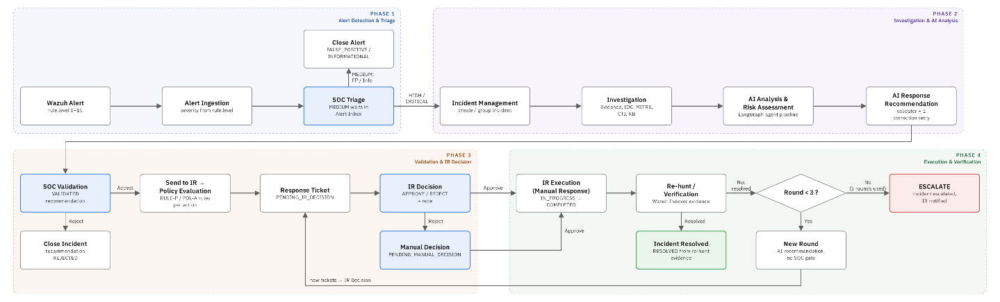

<!--
ฉบับแก้ไข v2 (2026-10-04) — จัดโครงสร้างตาม P1–P4 → O1–O5 → องค์ประกอบระบบ → ตัวชี้วัด → ผล
แหล่งผลหลัก: run `final-evaluation-v3.3` (commit 245b536, correctness-gt-v3.3)
แหล่งผลเสริม: supplementary-consistency-15r, supplementary-escalation, supplementary-ir-reject
ข้อค้นพบระยะพัฒนา (ไม่นับในตัวชี้วัด): targetrole-v2/v3 (2 ต.ค.), extended-evaluation (1 ต.ค.)
[ต้องยืนยัน: ...] = ต้องใช้ข้อมูลจากผู้เขียน; [ต้องตรวจสอบจากระบบ: ...] = ต้องดึงจากฐานข้อมูล/บันทึกการรัน
-->

**Kanoknipha Panset¹, Chakchai So-In¹** [ต้องยืนยัน: รูปแบบชื่อ ตำแหน่งวิชาการ และหมายเลขสังกัดตามข้อกำหนดของเวที]

¹College of Computing, Khon Kaen University, Thailand
kanoknipha.p@kkumail.com [ต้องยืนยัน: อีเมลผู้เขียนร่วม]

## บทคัดย่อ

บทความนี้นำเสนอ VIGIX ระบบสนับสนุนการตอบสนองต่อเหตุการณ์ด้านความมั่นคงปลอดภัยไซเบอร์สำหรับศูนย์ปฏิบัติการความมั่นคงปลอดภัยไซเบอร์ (SOC) VIGIX รับการแจ้งเตือนจาก Wazuh สกัดหลักฐานและตัวบ่งชี้การบุกรุก (IOC) ใช้แบบจำลองภาษาขนาดใหญ่ (LLM) ร่วมกับการค้นคืนความรู้เสนอคำแนะนำการตอบสนอง ตรวจคำแนะนำด้วยกฎของระบบ ส่งให้ทีมตอบสนองต่อเหตุการณ์ (IR) ตัดสินใจ และตรวจสอบผลหลังการตอบสนองด้วยการค้นหาซ้ำ (re-hunt) บน Wazuh โดย LLM ไม่มีสิทธิ์กำหนดความรุนแรง อนุมัติ หรือดำเนินการตอบสนอง การประเมินใช้กรณีทดสอบ 10 กรณีในห้องปฏิบัติการ ด้วย Wazuh 4.9.2 เครื่องปลายทาง Linux และ Windows 10 ที่ติดตั้ง Sysmon ผลการทดลองพบว่า ระบบรับการแจ้งเตือนและกำหนดความรุนแรงตรงกับที่คาดหวังครบ 10 กรณี สกัด IOC ได้ครบ 21 จาก 23 รายการ (ร้อยละ 91.30) ใช้เวลาตั้งแต่เริ่มสืบสวนจนได้คำแนะนำเฉลี่ย 95.86 วินาที (n = 9) คำแนะนำทั้ง 9 รายการที่สร้างได้ผ่านเกณฑ์การปฏิบัติตามกฎ 7 ด้าน แต่ตรงกับคำตอบอ้างอิงทั้งชุดเพียง 4 จาก 10 กรณี ส่วนใหญ่เพราะเสนอการดำเนินการเพิ่ม และกรณี PowerShell สร้างคำแนะนำที่ผ่านการตรวจไม่ได้ ไม่พบการตอบสนองที่ข้ามการอนุมัติของทีม IR กระบวนการดำเนินจนถึงการตรวจสอบผลและได้ผล RESOLVED 7 จาก 10 กรณี โดยอีก 2 กรณีค้นหาซ้ำไม่ได้เพราะไม่มี IOC ชนิดที่ค้นหาได้ การทดลองเสริมแสดงว่าระบบเปลี่ยนสถานะเป็น escalated หลังค้นหาซ้ำไม่สำเร็จครบ 3 รอบ และไม่ดำเนินการเองเมื่อทีม IR ปฏิเสธคำแนะนำ ผลทั้งหมดมาจากการทดลองหนึ่งรอบ แบบจำลองเดียว และการอนุมัติด้วยสคริปต์ จึงแสดงการทำงานของระบบต้นแบบในสถานการณ์ที่ทดสอบ แต่ยังไม่ใช่หลักฐานประสิทธิผลในการปฏิบัติงานจริง

**คำสำคัญ** — ศูนย์ปฏิบัติการความมั่นคงปลอดภัยไซเบอร์, การตอบสนองต่อเหตุการณ์, แบบจำลองภาษาขนาดใหญ่, การทำงานร่วมกับมนุษย์, การค้นหาซ้ำ, Wazuh

## ABSTRACT

This paper presents VIGIX, a system that supports cybersecurity incident response in a security operations center (SOC). VIGIX ingests Wazuh alerts, extracts evidence and indicators of compromise (IOCs), uses a large language model (LLM) with knowledge retrieval to propose response recommendations, validates each recommendation against system rules, routes it to the incident response (IR) team for a decision, and verifies the outcome after the response by re-hunting in Wazuh. The LLM cannot set severity, approve, or execute a response. The evaluation used ten laboratory test cases with Wazuh 4.9.2, a Linux endpoint, and a Windows 10 endpoint with Sysmon. All ten alerts were ingested with the expected severity. IOC extraction found 21 of 23 expected IOCs (91.30%), and the mean time from investigation start to recommendation was 95.86 s (n = 9). All nine recommendations that were produced satisfied a seven-criterion rule-compliance check, but only 4 of 10 matched the action–target ground truth exactly, mostly because of additional actions; the PowerShell case produced no recommendation that passed validation. No response bypassed IR approval. The workflow reached verification with a RESOLVED result in 7 of 10 cases; two cases could not be re-hunted because no searchable IOC was available. Supplementary tests showed escalation after three unresolved re-hunt rounds and no automatic execution after an IR rejection. All results come from one run, one LLM, and scripted approval; they show how the prototype behaves in the tested scenarios and are not evidence of effectiveness in operational use.

**Keywords** — security operations center (SOC); incident response; large language model; human-in-the-loop; re-hunting; Wazuh

## 1. บทนำ

### 1.1 ความเป็นมา

ศูนย์ปฏิบัติการความมั่นคงปลอดภัยไซเบอร์ (SOC) ต้องจัดการการแจ้งเตือนผ่านหลายขั้นตอน ได้แก่ รับการแจ้งเตือน สืบสวนและรวบรวมหลักฐานกับ IOC กำหนดแนวทางตอบสนอง ให้ผู้มีอำนาจตัดสินใจ ดำเนินการตอบสนอง และตรวจสอบผล งานที่ผ่านมารายงานว่าเมื่อมีการแจ้งเตือนจำนวนมาก ภาระงานของนักวิเคราะห์จะเพิ่มขึ้นและอาจกระทบการตัดสินใจ [1], [5] และแนวทางของ NIST จัดการตอบสนองต่อเหตุการณ์ไว้ในวงจรที่ต่อเนื่องถึงการฟื้นฟู [8] การตอบสนองจึงควรมีการตรวจสอบผลหลังดำเนินการ ไม่ใช่สิ้นสุดเมื่อดำเนินการเสร็จ

งานที่ผ่านมานำ LLM มาช่วยเพิ่มบริบทของการแจ้งเตือน สร้างแนวทางการตอบสนอง และสนับสนุนนักวิเคราะห์ [1], [3]–[7] แต่คำแนะนำจาก LLM อาจอ้างเป้าหมายที่ไม่มีในหลักฐาน หรือเสนอการดำเนินการที่ไม่สอดคล้องกับนโยบาย จึงต้องตรวจสอบก่อนนำไปใช้ [2] และผู้ปฏิบัติงานควรเป็นผู้ตัดสินใจขั้นสุดท้าย [5] งานนี้จึงพัฒนา VIGIX เพื่อเชื่อมขั้นตอนเหล่านี้เป็นกระบวนการเดียว ตั้งแต่การแจ้งเตือนจาก Wazuh จนถึงการตรวจสอบผลหลังการตอบสนอง โดยให้ LLM ทำหน้าที่เสนอคำแนะนำเท่านั้น

### 1.2 ปัญหา

งานนี้กำหนดปัญหา 4 ข้อตามขั้นตอนของกระบวนการทำงาน

- **P1 หลักฐานและ IOC:** ในขั้นสืบสวน หลักฐานและ IOC อยู่ในหลายฟิลด์ของการแจ้งเตือน หาก IOC ไม่ถูกสกัดและบันทึกไว้ ขั้นตอนถัดไปจะไม่มีเป้าหมายสำหรับการตอบสนองและเงื่อนไขสำหรับการตรวจสอบผล
- **P2 การตรวจคำแนะนำ:** คำแนะนำที่สร้างโดย LLM อาจอ้างเป้าหมายที่ไม่อยู่ในหลักฐาน หรือเสนอการดำเนินการที่ไม่อยู่ในแคตตาล็อก นโยบาย หรือ playbook จึงต้องตรวจก่อนส่งให้ผู้ตัดสินใจ
- **P3 การตัดสินใจของมนุษย์และการควบคุมการตอบสนอง:** การตอบสนองต้องเกิดหลังการอนุมัติของทีม IR เท่านั้น และเมื่อทีม IR ปฏิเสธ ระบบต้องไม่ดำเนินการ ไม่สร้างคำแนะนำใหม่ และไม่ปิดเหตุการณ์เอง
- **P4 การตรวจสอบผลหลังการตอบสนอง:** การอนุมัติหรือการดำเนินการไม่ได้ยืนยันว่าเหตุการณ์ถูกควบคุมแล้ว ต้องค้นหาเหตุการณ์ที่เกี่ยวข้องซ้ำ และส่งกลับไปสืบสวนหรือ escalate เมื่อยังไม่ยืนยันผล

### 1.3 วัตถุประสงค์

[ต้องยืนยัน: เทียบถ้อยคำ O1–O5 กับฉบับ paper.pdf; ฉบับนี้กำหนดตามความสัมพันธ์ P → O ที่ผู้เขียนให้ไว้]

- **O1** เชื่อมต่อ Wazuh เพื่อรับการแจ้งเตือน กำหนดความรุนแรงจาก rule level และเปิดเหตุการณ์
- **O2** รวบรวมหลักฐานและสกัด IOC จากการแจ้งเตือนเพื่อใช้ในการสืบสวน
- **O3** สร้างคำแนะนำการตอบสนองด้วย LLM ร่วมกับ RAG ตรวจคำแนะนำด้วยกฎของระบบ และส่งให้ทีม IR ตัดสินใจก่อนการตอบสนอง
- **O4** ตรวจสอบผลหลังการตอบสนองด้วยการค้นหาซ้ำบน Wazuh และเปลี่ยนสถานะเป็น escalated เมื่อไม่ยืนยันผลภายในจำนวนรอบที่กำหนด
- **O5** ประเมินการทำงานของระบบในห้องปฏิบัติการด้วยตัวชี้วัดที่ตอบ O1–O4

**ตารางที่ 1** ความสัมพันธ์ระหว่างปัญหา วัตถุประสงค์ องค์ประกอบระบบ และตัวชี้วัด

| ปัญหา | วัตถุประสงค์ | องค์ประกอบระบบ | ตัวชี้วัด |
|---|---|---|---|
| — | O1 | รับการแจ้งเตือน, กำหนดความรุนแรง, เปิดเหตุการณ์ | การรับและกำหนดความรุนแรงถูกต้อง |
| P1 | O2, O3 | สกัด IOC, รวมหลักฐาน, เป้าหมายของคำแนะนำ | IOC Extraction Completeness, Investigation Time |
| P2 | O3 | LLM + RAG, ตัวตรวจคำแนะนำ | Recommendation Compliance, Correct Recommendation, Recommendation Consistency |
| P3 | O3 | การอนุมัติของทีม IR, ใบงานตอบสนอง, บันทึกตรวจสอบ | การป้องกันการตอบสนองที่ไม่ได้รับอนุมัติ, Time-to-Decision |
| P4 | O4 | การค้นหาซ้ำ, การเปิดรอบสืบสวนใหม่, การ escalate | Workflow Completeness, ผลการตรวจสอบ, Escalation |
| — | O5 | การทดลอง 10 กรณีและการทดลองเสริม | ตารางสรุปผลทั้งหมด |

### 1.4 ขอบเขต

งานนี้เป็นการพัฒนาและทดสอบระบบต้นแบบ จำกัดอยู่ที่การตอบสนองระยะสั้น (short-term containment) ในห้องปฏิบัติการ ใช้กรณีทดสอบ 10 กรณี แบบจำลองภาษาหนึ่งแบบจำลอง และการอนุมัติด้วยสคริปต์แทนผู้ปฏิบัติงาน VIGIX ไม่ใช่ระบบ SIEM โดยใช้ Wazuh เป็นแหล่งการแจ้งเตือนและแหล่งข้อมูลสำหรับการค้นหาซ้ำ

## 2. งานที่เกี่ยวข้อง

งานที่เกี่ยวข้องจัดกลุ่มตามปัญหา P1–P4 สำหรับแต่ละงานจะระบุว่า งานนั้นทำอะไร สิ่งใดที่งานนั้นไม่ได้รายงาน และ VIGIX จึงต้องทำอะไร ตารางที่ 2 สรุปผลการเทียบ คำว่า "ไม่ได้รายงาน" หมายถึงไม่พบในบทความฉบับเต็มที่ตรวจ ไม่ได้หมายความว่าแนวทางของงานนั้นทำไม่ได้

**LLM ใน SOC (P1, P3)** Singh et al. ศึกษาการใช้ LLM ของนักวิเคราะห์ SOC และพบว่านักวิเคราะห์ยังเป็นผู้ตรวจสอบและตัดสินใจ [5] Sheikhi et al. ใช้ LLM หลายเอเจนต์สร้างคำอธิบายเหตุการณ์ที่อ้างอิงหลักฐาน [6] และ Rieger et al. รายงานว่า LLM จำแนกการแจ้งเตือนได้ดีกว่าการจัดลำดับความสำคัญ [7] งานกลุ่มนี้สนับสนุนว่าการวิเคราะห์ควรอ้างหลักฐานและให้คนตัดสินใจ แต่ไม่ได้มุ่งที่การตรวจผลหลังการตอบสนอง

**RAG และ CTI สำหรับการสร้างคำแนะนำ (P1, P2)** Ismail et al. ใช้เหตุการณ์จาก Wazuh ร่วมกับ RAG และ LLM สร้างคู่มือการตอบสนองให้นักวิเคราะห์ โดยค้นคืนความรู้จากคู่มือการตอบสนอง NIST CSF 2.0 และ MITRE ATT&CK ระบบทำหน้าที่ให้คำแนะนำโดยไม่ดำเนินการเอง นักวิเคราะห์ทบทวนและถามต่อผ่านส่วนสนทนา และประเมินโดยเทียบความคล้ายของข้อความกับคำตอบอ้างอิง (cosine similarity และ BERTScore) [1] Tellache et al. ใช้ RAG ร่วมกับฐานข้อมูลเวกเตอร์และแพลตฟอร์ม CTI สร้างกลยุทธ์ลดผลกระทบจากการแจ้งเตือน และประเมินด้วยตัวชี้วัดที่ให้คะแนนโดย LLM ร่วมกับการตรวจของผู้เชี่ยวชาญ [3] ทั้งสองงานไม่ได้รายงานการตรวจคำแนะนำกับนโยบาย แคตตาล็อกการดำเนินการ หรือ playbook ขององค์กรก่อนนำไปใช้ และไม่ได้รายงานการตรวจผลหลังการตอบสนอง VIGIX จึงต้องมีตัวตรวจคำแนะนำ (P2) และขั้นค้นหาซ้ำ (P4)

**เอเจนต์หลายตัวในการจำลองการตอบสนอง (P2, P3)** Liu and Anwar ใช้ RAG กับทีมเอเจนต์ LLM ในเกมจำลองสถานการณ์ Backdoors & Breaches โดยเอเจนต์ทำหน้าที่แทนผู้เล่นที่เป็นคน และความสำเร็จตัดสินด้วยกติกาของเกม วัดผลด้วยอัตราการชนะ [4] งานนี้จึงไม่มีขั้นการตัดสินใจของคนและไม่มีการตรวจผลจากระบบเฝ้าระวังจริง ต่างจาก VIGIX ที่ใช้การแจ้งเตือนจริงจาก Wazuh และให้ทีม IR ตัดสินใจ

**นโยบายและการอนุมัติ (P2, P3)** Barbieri et al. ตรวจแผนการตอบสนองที่ LLM สร้างกับขั้นตอนบังคับ ลำดับขั้น และจุดอนุมัติ ก่อนส่งให้นักวิเคราะห์ [2] งานนี้ใกล้กับ P2 และ P3 มากที่สุด แต่ตรวจที่ขอบเขตของแผนก่อนการตัดสินใจ และไม่ได้รายงานการตรวจผลหลังการตอบสนอง

**การตรวจสอบผลหลังการตอบสนอง (P4)** แนวทางของ NIST เชื่อมการตอบสนองต่อเหตุการณ์เข้ากับการฟื้นฟูและการปรับปรุง [8] ในงาน [1]–[5] ที่ตรวจฉบับเต็มหรือบทคัดย่อแล้ว ไม่พบการค้นหาซ้ำบนระบบเฝ้าระวังเพื่อยืนยันผลหลังการตอบสนอง VIGIX จึงเพิ่มขั้นตรวจสอบผลด้วยการค้นหาซ้ำ (P4)

**ตารางที่ 2** งานที่เกี่ยวข้องเทียบกับปัญหา P1–P4 (ตรวจจากบทความฉบับเต็ม ยกเว้น [2] และ [5] ที่ตรวจจากบทคัดย่อ)

| งาน | สิ่งที่ทำ | P1 หลักฐาน/IOC | P2 ตรวจคำแนะนำ | P3 คนตัดสินใจ | P4 ตรวจผลหลังตอบสนอง |
|---|---|---|---|---|---|
| Ismail et al. [1] | Wazuh + RAG + LLM สร้างคู่มือการตอบสนอง (ให้คำแนะนำเท่านั้น) | ใช้เหตุการณ์ Wazuh | ไม่ได้รายงาน (ใช้ NIST CSF/MITRE เป็นแหล่งความรู้ ไม่ใช่ตัวตรวจ) | นักวิเคราะห์ทบทวนผ่านส่วนสนทนา; ไม่มีขั้นอนุมัติ | ไม่ได้รายงาน |
| Barbieri et al. [2] | ตรวจแผนการตอบสนองกับนโยบาย | ไม่ใช่ประเด็นหลัก | ตรวจขั้นตอนบังคับ ลำดับ จุดอนุมัติ | มีจุดอนุมัติก่อนนักวิเคราะห์ | ไม่ได้รายงาน |
| Tellache et al. [3] | CTI + RAG + LLM สร้างกลยุทธ์ลดผลกระทบ | เพิ่มบริบทจาก CTI | ไม่ได้รายงาน (ประเมินด้วยคะแนนจาก LLM) | ผู้เชี่ยวชาญตรวจเพื่อการประเมิน ไม่ใช่ขั้นอนุมัติ | ไม่ได้รายงาน |
| Liu and Anwar [4] | เอเจนต์ LLM + RAG ในเกมจำลอง | ไม่ใช้การแจ้งเตือนจริง | ไม่ได้รายงาน | ไม่มี (เอเจนต์แทนผู้เล่น) | ตัดสินด้วยกติกาเกม |
| Singh et al. [5] | ศึกษาการใช้ LLM ของนักวิเคราะห์ | ไม่ใช่ประเด็นหลัก | ไม่ใช่ประเด็นหลัก | นักวิเคราะห์เป็นผู้ตัดสินใจ | ไม่ใช่ประเด็นหลัก |
| VIGIX (งานนี้) | ระบบต้นแบบตามกระบวนการ SOC/IR | สกัด IOC จากการแจ้งเตือน | ตัวตรวจ 5 กลุ่ม | อนุมัติโดยทีม IR | ค้นหาซ้ำบน Wazuh |

## 3. ข้อกำหนดและการออกแบบระบบ

### 3.1 ข้อกำหนดของระบบ

ข้อกำหนดหลักได้จากปัญหา P1–P4 ทุกข้อในตารางที่ 3 มีอยู่ในโค้ดรุ่น 245b536 ที่ใช้ในการทดลอง

**ตารางที่ 3** ข้อกำหนดของระบบและองค์ประกอบที่รองรับ

| รหัส | ข้อกำหนด | ปัญหา/วัตถุประสงค์ | องค์ประกอบในระบบ |
|---|---|---|---|
| R1 | รับการแจ้งเตือนจาก Wazuh และกำหนดความรุนแรงจาก rule level โดยไม่ใช้ AI | O1 | การรับการแจ้งเตือน (ingestion) |
| R2 | สกัด IOC จากการแจ้งเตือนและบันทึกเป็นหลักฐานของเหตุการณ์ | P1 / O2 | การสกัด IOC และการสืบสวน |
| R3 | เป้าหมายของคำแนะนำต้องเป็น IOC หรือโฮสต์ที่บันทึกไว้ในเหตุการณ์ | P1, P2 / O3 | ตัวตรวจคำแนะนำ ($V_T$) |
| R4 | ตรวจคำแนะนำกับหลักฐาน แคตตาล็อกการดำเนินการ นโยบาย และ playbook ก่อนส่งทีม IR | P2 / O3 | ตัวตรวจคำแนะนำ ($V_E$, $V_A$, $V_P$, $V_{PB}$) |
| R5 | การตอบสนองเริ่มได้หลังทีม IR อนุมัติเท่านั้น; LLM อนุมัติหรือดำเนินการไม่ได้ | P3 / O3 | การอนุมัติและใบงานตอบสนอง |
| R6 | เมื่อทีม IR ปฏิเสธ: ไม่ดำเนินการ ไม่สร้างคำแนะนำใหม่ ไม่ปิดเหตุการณ์ และบันทึกเหตุผล | P3 / O3 | การตัดสินใจด้วยตนเองของทีม IR |
| R7 | หลังการตอบสนองต้องค้นหาซ้ำบน Wazuh และตัดสินผลจากหลักฐานเท่านั้น | P4 / O4 | การตรวจสอบผล (verification) |
| R8 | เมื่อไม่ยืนยันผล ให้เปิดรอบสืบสวนใหม่ และ escalate เมื่อครบ 3 รอบ | P4 / O4 | การเปิดรอบใหม่และการ escalate |
| R9 | บันทึกทุกการตัดสินใจและการเปลี่ยนสถานะไว้ในบันทึกตรวจสอบ | P3, P4 | บันทึกตรวจสอบ (audit log) |

### 3.2 สถาปัตยกรรมและบทบาท

VIGIX ทำงานตามลำดับ การแจ้งเตือน → การสืบสวน → คำแนะนำ → การตรวจคำแนะนำ → การตัดสินใจของทีม IR → การตอบสนอง → การตรวจสอบผล/การค้นหาซ้ำ (ภาพที่ 1) ตัวควบคุมลำดับงานพัฒนาด้วย LangGraph ระบบจัดเก็บเวกเตอร์ความรู้ใน Qdrant และเก็บนโยบาย playbook runbook และแคตตาล็อกการดำเนินการผ่าน Prisma [ต้องยืนยัน: รุ่นของ LangGraph, Qdrant, Prisma และฐานข้อมูล]



[ต้องยืนยัน: ภาพที่ 1 มีเส้นทาง "SOC Validation → Reject → Close Incident" ซึ่งเนื้อหาไม่ได้อธิบาย ให้ยืนยันว่าเส้นทางนี้มีในระบบรุ่นที่ทดสอบหรือไม่ และใช้ชื่อขั้นตอนในภาพให้ตรงกับลำดับข้างต้น]

ระบบมีผู้ใช้สองบทบาท คือ นักวิเคราะห์ SOC และทีม IR ตารางที่ 4 แยกสิ่งที่แต่ละองค์ประกอบทำได้และทำไม่ได้

**ตารางที่ 4** บทบาทและสิทธิ์ขององค์ประกอบ

| องค์ประกอบ | ทำได้ | ทำไม่ได้ |
|---|---|---|
| LLM | วิเคราะห์หลักฐาน เสนอคำแนะนำพร้อมเหตุผล | กำหนดความรุนแรง อนุมัติ ดำเนินการตอบสนอง เปลี่ยนสถานะเหตุการณ์ |
| ระบบหลังบ้าน (backend) | กำหนดความรุนแรงจาก rule level ตรวจคำแนะนำ ประเมินนโยบาย ค้นหาซ้ำ เปลี่ยนสถานะตามผลตรวจสอบ | ดำเนินการตอบสนองแทนทีม IR |
| นักวิเคราะห์ SOC | คัดกรองการแจ้งเตือนระดับ medium ยืนยัน IOC | อนุมัติแทนทีม IR |
| ทีม IR | อนุมัติหรือปฏิเสธคำแนะนำ ตัดสินใจและตอบสนองด้วยตนเองพร้อมบันทึกเหตุผล | กำหนดผล RESOLVED โดยไม่มีหลักฐานจากการค้นหาซ้ำ |

### 3.3 การรับการแจ้งเตือน (O1)

**ข้อมูลนำเข้า:** การแจ้งเตือนจาก Wazuh ได้แก่ Rule ID, rule level, agent, เวลา, IP ต้นทาง/ปลายทาง และข้อมูลเหตุการณ์ **กระบวนการ:** ระบบกำหนดความรุนแรงจาก rule level ด้วยการแปลงค่าที่กำหนดไว้ (สมการที่ 1) ระดับ LOW ถูกเก็บไว้แต่ไม่เข้าสู่กระบวนการ SOC ระดับ MEDIUM รอนักวิเคราะห์ SOC คัดกรอง ระดับ HIGH และ CRITICAL เปิดเหตุการณ์อัตโนมัติ **ผลลัพธ์:** เหตุการณ์พร้อมความรุนแรง [ต้องยืนยัน: ช่วง rule level ของแต่ละระดับในโค้ด; ในการทดลองพบ level 7 และ 10 → medium, 12–13 → high, 14 → critical]

$$Severity = f(\mathit{RuleLevel}_{Wazuh}),\quad Severity \in \{LOW, MEDIUM, HIGH, CRITICAL\} \tag{1}$$

### 3.4 การสืบสวนและการสร้างคำแนะนำ (O2, O3)

**ข้อมูลนำเข้า:** การแจ้งเตือน หลักฐาน และ IOC **กระบวนการ:** ระบบสกัด IOC จากฟิลด์ของการแจ้งเตือนและบันทึกเป็นหลักฐาน จากนั้นรวมข้อมูลข่าวกรอง เทคนิค MITRE ATT&CK และฐานความรู้ (นโยบาย playbook runbook แคตตาล็อกการดำเนินการ) แล้วค้นคืนความรู้ที่เกี่ยวข้องเป็นบริบทให้ LLM เสนอคำแนะนำ คำแนะนำหนึ่งชุดประกอบด้วยขั้นตอน แต่ละขั้นมีการดำเนินการ เป้าหมาย เหตุผล และหลักฐานอ้างอิง (สมการที่ 2) **ผลลัพธ์:** คำแนะนำที่รอการตรวจ

$$\rho = \{(a_j, t_j, \mathit{reason}_j, \mathit{evidence}_j)\}_{j=1}^{m} \tag{2}$$

ตัวตรวจคำแนะนำ (validator) ตรวจทุกขั้นตอนด้วยกฎ 5 กลุ่ม (สมการที่ 3 และตารางที่ 5) คำแนะนำผ่านเมื่อไม่มีข้อผิดพลาดในทุกกลุ่ม หากไม่ผ่าน ระบบให้ LLM แก้ไขอัตโนมัติได้ 1 ครั้งภายในการเรียกแต่ละครั้ง คำแนะนำที่ไม่ผ่านจะไม่ถูกส่งให้ทีม IR และไม่ถือว่าเป็นคำแนะนำที่ใช้ได้

$$\mathit{Valid}(\rho) = V_E(\rho) \land V_A(\rho) \land V_T(\rho) \land V_P(\rho) \land V_{PB}(\rho) \tag{3}$$

**ตารางที่ 5** กลุ่มกฎของตัวตรวจคำแนะนำกับรหัสข้อผิดพลาดในโค้ด

| กลุ่ม | ตรวจอะไร | รหัสข้อผิดพลาด (ตัวอย่าง) |
|---|---|---|
| $V_E$ หลักฐาน | หลักฐานที่อ้างมีจริง และเป้าหมายมีหลักฐานที่การดำเนินการนั้นต้องใช้ | INVENTED_EVIDENCE, INSUFFICIENT_EVIDENCE |
| $V_A$ การดำเนินการ | การดำเนินการมีอยู่และเปิดใช้งานในแคตตาล็อก | INVENTED_ACTION, DISABLED_ACTION |
| $V_T$ เป้าหมาย/IOC | เป้าหมายเป็น IOC หรือโฮสต์ที่บันทึกในเหตุการณ์ และเป็นชนิดที่การดำเนินการรองรับ | INVENTED_TARGET, TARGET_TYPE_MISMATCH |
| $V_P$ นโยบาย | บทบาทผู้รับผิดชอบและการต้องอนุมัติตรงกับนโยบาย | WRONG_RESPONSIBLE_ROLE, POLICY_BYPASS |
| $V_{PB}$ playbook/runbook | การดำเนินการอยู่ใน playbook ที่เลือกจากเทคนิค ATT&CK และ runbook ตรงกับการดำเนินการ | NO_PLAYBOOK, ACTION_NOT_IN_PLAYBOOK, PLAYBOOK_MISMATCH, RUNBOOK_MISMATCH |

### 3.5 การตัดสินใจของทีม IR และการตอบสนอง (O3)

**ข้อมูลนำเข้า:** คำแนะนำที่ผ่านการตรวจ **กระบวนการ:** ทีม IR เลือกอนุมัติหรือปฏิเสธ (สมการที่ 4) หากอนุมัติ ระบบสร้างใบงานตอบสนองให้ทีม IR ดำเนินการและบันทึกผล หากปฏิเสธ ระบบไม่เริ่มการตอบสนอง ไม่สร้างคำแนะนำใหม่ และไม่ปิดเหตุการณ์ ทีม IR ต้องบันทึกการตัดสินใจพร้อมเหตุผลก่อนตอบสนองด้วยตนเอง **ผลลัพธ์:** การตอบสนองที่บันทึกผลแล้ว และบันทึกตรวจสอบที่ระบุรหัสเหตุการณ์ คำแนะนำ การดำเนินการ เป้าหมาย การตัดสินใจ หมายเหตุ ผลการตอบสนอง และเวลา

$$\mathit{Decision} \in \{APPROVE, REJECT\} \tag{4}$$

### 3.6 การตรวจสอบผลและการค้นหาซ้ำ (O4)

**ข้อมูลนำเข้า:** IOC ของเหตุการณ์และการตอบสนองที่บันทึกว่าเสร็จแล้ว **กระบวนการ:** ระบบสร้างเงื่อนไขค้นหาจาก IOC แล้วค้นหาเหตุการณ์ที่เกี่ยวข้องใน Wazuh Indexer ภายในช่วงเวลาที่กำหนด และบันทึกเงื่อนไข 4 ข้อ ได้แก่ ควบคุมภัยได้หรือไม่ (ถ้าไม่ได้ = NOT_CONTAINED) พบการแพร่กระจายหรือไม่ (SPREAD) พบ IOC ซ้ำหรือไม่ และจำนวนเหตุการณ์ที่ตรงเงื่อนไข $m$ ในโค้ดรุ่นที่ทดสอบ ผลการตรวจสอบมี 2 ค่า (สมการที่ 5) โดย SPREAD และ NOT_CONTAINED เป็นเงื่อนไขที่ทำให้ผลเป็น NOT_RESOLVED ไม่ใช่ค่าผลแยก **ผลลัพธ์:** ผลการตรวจสอบและสถานะถัดไปของเหตุการณ์

$$v = \begin{cases} RESOLVED, & \mathit{contained} \land \lnot\mathit{spread} \land \lnot\mathit{recurrence} \land m = 0 \\ NOT\_RESOLVED, & \text{otherwise} \end{cases} \tag{5}$$

ค่า RESOLVED หมายถึงไม่พบเหตุการณ์ที่เกี่ยวข้องภายในขอบเขตและช่วงเวลาที่ค้นหาเท่านั้น ไม่ได้ยืนยันว่ากำจัดภัยคุกคามได้ทั้งหมด หากเหตุการณ์ไม่มี IOC ชนิดที่ค้นหาได้ ระบบไม่ค้นหาและบันทึกเป็น REHUNT_INSUFFICIENT_CRITERIA ซึ่งต่างจาก NOT_RESOLVED และเหตุการณ์ยังเปิดอยู่

ให้ $r$ คือลำดับรอบการสืบสวน (เริ่มที่ 1) และ $R_{max} = 3$ สถานะถัดไปกำหนดตามสมการที่ 6 เมื่อผลเป็น NOT_RESOLVED และยังไม่ครบ 3 รอบ ระบบเปิดการสืบสวนรอบใหม่ นำผลการค้นหาเข้าเป็นหลักฐาน และพยายามสร้างคำแนะนำใหม่ให้ทีม IR พิจารณา เมื่อครบ 3 รอบแล้วยังไม่เป็น RESOLVED ระบบเปลี่ยนสถานะเป็น escalated และส่งต่อให้ SOC และทีม IR โดยไม่ปิดเหตุการณ์ สถานะ resolved กำหนดได้จากผลการค้นหาซ้ำเท่านั้น

$$\mathit{Next} = \begin{cases} resolved, & v = RESOLVED \\ \text{เปิดรอบ } r+1, & v = NOT\_RESOLVED \land r < R_{max} \\ escalated, & v = NOT\_RESOLVED \land r \ge R_{max} \end{cases} \tag{6}$$

**Algorithm 1** กระบวนการตอบสนองต่อเหตุการณ์ของ VIGIX

```text
Input : alert a from Wazuh; R_max = 3; K = max recommendation calls (K = 5 in the experiment)
Output: final incident status
 1: sev ← MapSeverity(a.rule_level)                       ▷ Eq. (1), deterministic, not AI
 2: if sev = LOW then store a; return NOT_IN_WORKFLOW
 3: if sev = MEDIUM and SOC_Triage(a) = CLOSE then return CLOSED_ALERT
 4: I ← CreateIncident(a, sev); r ← 1
 5: loop
 6:   E, IOC ← CollectEvidence(I)                         ▷ P1
 7:   C ← Context(E, IOC, TI, ATT&CK); Kn ← RAG_Retrieve(C)
 8:   ρ ← ∅
 9:   for k ← 1 to K do                                   ▷ each call allows one auto-correction
10:     ρ̂ ← LLM_Recommend(C, Kn)
11:     if Valid(ρ̂) then ρ ← ρ̂; break                    ▷ Eq. (3), P2
12:   if ρ = ∅ then log NO_VALID_RECOMMENDATION; return OPEN   ▷ left to SOC/IR
13:   d ← IR_Decision(ρ)                                 ▷ Eq. (4), P3; LLM cannot decide
14:   if d = APPROVE then IR executes ρ and records the result
15:   else IR records a manual decision with a note, then a manual response
16:   q ← BuildRehuntQuery(IOC)
17:   if q = ∅ then log REHUNT_INSUFFICIENT_CRITERIA; return OPEN
18:   v ← Verify(q, time window)                          ▷ Eq. (5), P4
19:   if v = RESOLVED then return RESOLVED                 ▷ set by backend
20:   if r ≥ R_max then return ESCALATED                   ▷ handed to SOC and IR
21:   r ← r + 1; add re-hunt results to E                  ▷ back to investigation
22: end loop
```

[ต้องยืนยัน: บรรทัดที่ 9 และ 12 อธิบายพฤติกรรมที่พบในการทดลอง (ชุดทดสอบเรียกได้ไม่เกิน 5 ครั้ง) ให้ยืนยันว่าระบบจริงมีขีดจำกัดจำนวนครั้งเท่าใด และมีเส้นทางให้ทีม IR ตัดสินใจเองเมื่อไม่มีคำแนะนำที่ผ่านการตรวจหรือไม่]

## 4. วิธีประเมิน (O5)

### 4.1 สภาพแวดล้อม

การทดลองหลัก (run `final-evaluation-v3.3`) ดำเนินการวันที่ 3 ตุลาคม 2569 เวลา 11:38–12:04 UTC ด้วยโค้ด commit 245b536 ซึ่งไม่มีการแก้ไขระหว่างรัน ใช้ Wazuh 4.9.2 (manager บน Docker) เครื่องปลายทาง Linux (agent `attack-endpoint`) และเครื่องปลายทาง Windows 10 ที่ติดตั้ง Wazuh agent 4.9.2 และ Sysmon 15.22 (agent `vigix-win10-ps`) แบบจำลองภาษาคือ `gemma4-26b-uncensored` ผ่านเครื่องให้บริการ vLLM (`vllm-spark-01`) [ต้องยืนยัน: ผู้ดูแลและที่ตั้งของเครื่องให้บริการ ค่า temperature และ seed] ฐานข้อมูลการประเมินแยกจากระบบอื่นและว่างก่อนเริ่มรัน ชุดทดสอบอัตโนมัติ 12 ชุด (210 รายการ) ผ่านทั้งหมดก่อนรัน การตัดสินใจของทีม IR ใช้สคริปต์อนุมัติทุกคำแนะนำ และการตอบสนองเป็นการบันทึกผลจำลอง ไม่มีการปิดกั้นหรือแยกเครื่องจริง

### 4.2 กรณีทดสอบ

การแจ้งเตือนทั้ง 10 กรณีเป็นการแจ้งเตือนจริงจาก Wazuh ที่เกิดจากสถานการณ์ที่ควบคุมในห้องปฏิบัติการ สร้างด้วย 3 วิธี ได้แก่ กฎมาตรฐานของ Wazuh (TC-01, 04, 06) กฎที่เขียนเพิ่มร่วมกับกิจกรรมจริงบนเครื่องปลายทาง (TC-02, 05, 10) และกฎที่เขียนเพิ่มร่วมกับข้อมูลเหตุการณ์ที่ควบคุม (TC-03, 07, 08, 09) กฎที่เขียนเพิ่มออกแบบให้ตรงกับค่าที่ใช้ในห้องปฏิบัติการ ผลการตรวจจับจึงไม่ได้แสดงความสามารถตรวจจับของ Wazuh ในสภาพจริง สำหรับ TC-05 ผู้ทดลองสั่ง PowerShell ให้ค้นหาชื่อโดเมนทดสอบบนเครื่อง Windows ซึ่ง Sysmon บันทึกเป็น Event ID 22 ทุกกรณีถูกประเมินและไม่มีกรณีใดถูกตัดออก

**ตารางที่ 6** กรณีทดสอบและวิธีสร้างการแจ้งเตือน

| กรณี | สถานการณ์ | กฎ Wazuh (level) | วิธีสร้างการแจ้งเตือน | ความรุนแรงที่ระบบกำหนด |
|---|---|---|---|---|
| TC-01 | Brute force (SSH) | 5712 (10) | กฎมาตรฐาน | medium |
| TC-02 | Malware | 100301 (12) | กฎเพิ่ม + กิจกรรมจริง | high |
| TC-03 | Phishing | 100310 (10) | กฎเพิ่ม + ข้อมูลควบคุม | medium |
| TC-04 | Account compromise | 40112 (12) | กฎมาตรฐาน | high |
| TC-05 | PowerShell (Windows) | 100300 (12) | กฎเพิ่ม + กิจกรรมจริง (ผู้ทดลองสั่ง) | high |
| TC-06 | SQL injection | 31103 (7) | กฎมาตรฐาน | medium |
| TC-07 | Command and control | 100320 (13) | กฎเพิ่ม + ข้อมูลควบคุม | high |
| TC-08 | Suspicious process | 100330 (10) | กฎเพิ่ม + ข้อมูลควบคุม | medium |
| TC-09 | Data exfiltration | 100340 (13) | กฎเพิ่ม + ข้อมูลควบคุม | high |
| TC-10 | Privilege escalation | 100350 (14) | กฎเพิ่ม + กิจกรรมจริง | critical |

### 4.3 คำตอบอ้างอิง (Ground Truth)

คำตอบอ้างอิงของแต่ละกรณีประกอบด้วย ความรุนแรงที่คาดหวัง รายการ IOC ที่คาดหวัง (รวม 23 รายการ) playbook ที่คาดหวัง และชุดคู่การดำเนินการ–เป้าหมายที่ต้องมี (รวม 20 คู่ ไม่มีคู่ที่เป็นทางเลือก) ผู้พัฒนาระบบกำหนดจากข้อมูลของการแจ้งเตือน รุ่นที่ใช้ (`correctness-gt-v3.3`) ถูกตรึงไว้ที่ commit 444fed9 ก่อนรัน และค่า SHA-256 ก่อนและหลังรันตรงกัน [ต้องยืนยัน: ผู้อนุมัติคำตอบอ้างอิง] ข้อจำกัดที่ต้องเปิดเผยคือ คำตอบอ้างอิงรุ่น 3.1–3.3 ถูกปรับหลังผู้พัฒนาเห็นผลการทดลองรุ่นก่อน กรณีทั้ง 10 ถูกใช้ระหว่างการพัฒนาด้วย และยังไม่มีผู้เชี่ยวชาญอิสระตรวจ

### 4.4 ตัวชี้วัด

ตารางที่ 7 แสดงตัวชี้วัดของแต่ละวัตถุประสงค์ พร้อมนิยาม ตัวหาร และแหล่งข้อมูล ให้ $N = 10$ คือจำนวนกรณีทั้งหมด $N_{rec}$ คือจำนวนกรณีที่มีคำแนะนำผ่านการตรวจ $P_i$ คือชุดคู่การดำเนินการ–เป้าหมายที่ระบบเสนอในกรณี $i$ และ $P^{*}_i$ คือชุดในคำตอบอ้างอิง

**ตารางที่ 7** ตัวชี้วัด นิยาม และแหล่งข้อมูล

| วัตถุประสงค์ | ตัวชี้วัด | นิยาม (ตัวตั้ง/ตัวหาร) | แหล่งข้อมูล |
|---|---|---|---|
| O1 | การรับและกำหนดความรุนแรง | กรณีที่ rule, level, MITRE และความรุนแรงตรงที่คาดหวัง / N | ผลรายกรณี (`wazuh`, `severity`) |
| O2 (P1) | IOC Extraction Completeness | IOC ที่คาดหวังซึ่งพบในชุด IOC ที่ระบบบันทึก ก่อนนักวิเคราะห์แก้ไข / IOC ที่คาดหวังทั้งหมด (สมการที่ 7) | ผลรายกรณี (`iocRecall`) |
| O2 (P1) | Investigation Time | เวลาตั้งแต่เริ่มสืบสวนจนบันทึกคำแนะนำที่ผ่านการตรวจ (สมการที่ 8) เฉพาะกรณีที่มีคำแนะนำ | timestamp ในบันทึกการรัน |
| O3 (P2) | Recommendation Compliance | กรณีที่คำแนะนำผ่านเกณฑ์ 7 ด้าน / $N_{rec}$ (สมการที่ 9) | สคริปต์ประเมินแบบกำหนดแน่นอน |
| O3 (P2) | Correct Recommendation | กรณีที่ playbook ตรงและชุดคู่ตรงคำตอบอ้างอิงทั้งชุด / N (สมการที่ 10) | คำตอบอ้างอิง v3.3 |
| O3 (P2) | Recommendation Consistency (เสริม) | ครั้งที่ชุดคำแนะนำตรงกับชุดที่พบบ่อยที่สุด / ครั้งที่ได้คำแนะนำที่ผ่านการตรวจ (สมการที่ 11) | การทดลองเสริม 15 รอบ |
| O3 (P3) | การป้องกันการตอบสนองที่ไม่ได้รับอนุมัติ | จำนวนการตอบสนองที่เริ่มโดยไม่มีการอนุมัติของ IR_TEAM | บันทึกตรวจสอบ |
| O3 (P3) | Time-to-Decision | เวลาตั้งแต่บันทึกคำแนะนำจนบันทึกการตัดสินใจ ในการทดลองนี้วัดได้เพียงเวลาที่ระบบบันทึกการอนุมัติแบบสคริปต์ ไม่ใช่เวลาที่คนใช้ตัดสินใจ | timestamp ในบันทึกการรัน |
| O4 (P4) | Workflow Completeness | กรณีที่ผ่านครบทุกขั้นจนถึงการค้นหาซ้ำ / N | ผลรายกรณี (`workflow`) |
| O4 (P4) | ผลการตรวจสอบ | กรณีที่ได้ RESOLVED / N และ REHUNT_INSUFFICIENT_CRITERIA / N | ผลรายกรณี |
| O4 (P4) | Escalation | เหตุการณ์ที่ถูก escalate / เหตุการณ์ที่มีการค้นหาซ้ำ | ผลหลักและการทดลองเสริม |

$$Completeness_{IOC} = \frac{\sum_i N^{found}_{IOC,i}}{\sum_i N^{expected}_{IOC,i}} \times 100 \tag{7}$$

$$T_i = t^{rec}_i - t^{inv\_start}_i \tag{8}$$

$$RC = \frac{1}{N_{rec}}\sum_{i=1}^{N_{rec}} \mathit{Compliant}_i \times 100 \tag{9}$$

$$CR = \frac{1}{N}\sum_{i=1}^{N}\big[\,PB_i = PB^{*}_i \,\land\, P_i = P^{*}_i\,\big] \times 100 \tag{10}$$

$$RCons = \frac{n_{modal}}{n_{valid}} \times 100 \tag{11}$$

เกณฑ์ Compliance 7 ด้าน ได้แก่ การดำเนินการอยู่ในชุดที่อนุญาตสำหรับการโจมตีนั้น (attackAlignment) เป้าหมายเชื่อมกับหลักฐาน (evidenceSupport) การดำเนินการอยู่ในแคตตาล็อก (knowledgeValidity) การต้องอนุมัติและบทบาทตรงนโยบาย (policyCompliance) playbook ตรงกับที่คาดหวัง (playbookAlignment) การอนุมัติทำโดยบทบาทที่ถูกต้อง (approvalCorrectness) และ IP ที่ปิดกั้นเป็นฝั่งต้นทางหรือปลายทางถูกต้อง (targetRole) การให้คะแนนทำโดยสคริปต์ ไม่ได้ใช้ LLM หรือผู้ประเมินที่เป็นคน และเกณฑ์ส่วนหนึ่งซ้อนกับกฎของตัวตรวจคำแนะนำ Compliance จึงวัดว่าคำแนะนำอยู่ภายในกรอบกฎของระบบ ส่วน Correct Recommendation วัดว่าคำแนะนำตรงกับคำตอบอ้างอิงหรือไม่ ทั้งสองค่าจึงต้องรายงานคู่กัน การเทียบคู่การดำเนินการ–เป้าหมายไม่สนใจลำดับ ไม่สนตัวพิมพ์ และนับคู่ซ้ำครั้งเดียว และนับกรณีที่ไม่มีคำแนะนำว่าไม่ตรง

### 4.5 การทดลองเสริม

การทดลองเสริม 3 ชุดรันแยกจากการทดลองหลักด้วยโค้ดรุ่นเดียวกัน และไม่นำผลไปรวมกับตัวชี้วัดหลัก (1) **ความสม่ำเสมอ (P2):** สร้างคำแนะนำซ้ำ 15 ครั้งต่อกรณีสำหรับ TC-03, TC-08 และ TC-10 บนเหตุการณ์และหลักฐานชุดเดิม (2) **การ escalate (P4):** ใช้ข้อมูลเหตุการณ์ C2 ของ TC-07 และสร้างเหตุการณ์ซ้ำหลังการตอบสนองแต่ละรอบ (3) **การปฏิเสธโดยทีม IR (P3):** ใช้ TC-01 และให้สคริปต์ปฏิเสธคำแนะนำ

## 5. ผลการทดลอง

### 5.1 ผลรายกรณี

**ตารางที่ 8** ผลรายกรณีของการทดลองหลัก (อ่านจากไฟล์ผลรายกรณีของ run `final-evaluation-v3.3`)

| กรณี | IOC (P1) | การเรียก (ไม่ผ่าน) | Compliance | ตรงคำตอบอ้างอิง | ความไม่ตรง | ค้นหาซ้ำ (P4) | เวลา (วินาที) |
|---|---|---|---|---|---|---|---|
| TC-01 | 2/2 | 1 (0) | ผ่าน | ตรง | – | RESOLVED | 54.74 |
| TC-02 | 0/2 | 1 (0) | ผ่าน | ไม่ตรง | ขาด QUARANTINE-FILE, BLOCK-HASH | ค้นหาไม่ได้\* | 75.44 |
| TC-03 | 4/4 | 3 (2) | ผ่าน | ตรง | – | RESOLVED | 243.43 |
| TC-04 | 2/2 | 1 (0) | ผ่าน | ไม่ตรง | เกิน REVOKE-SESSION | RESOLVED | 93.32 |
| TC-05 | 1/1 | 5 (5) | – | ไม่ตรง | ไม่มีคำแนะนำที่ผ่านการตรวจ | ไม่ถึงขั้นนี้ | – |
| TC-06 | 1/1 | 1 (0) | ผ่าน | ตรง | – | RESOLVED | 47.10 |
| TC-07 | 3/3 | 1 (0) | ผ่าน | ไม่ตรง | เกิน BLOCK-URL, ISOLATE-ENDPOINT | RESOLVED | 83.99 |
| TC-08 | 4/4 | 1 (0) | ผ่าน | ตรง | – | RESOLVED | 115.56 |
| TC-09 | 3/3 | 1 (0) | ผ่าน | ไม่ตรง | เกิน BLOCK-URL, ISOLATE-ENDPOINT | RESOLVED | 77.77 |
| TC-10 | 1/1 | 1 (0) | ผ่าน | ไม่ตรง | เกิน REVOKE-SESSION | ค้นหาไม่ได้\* | 71.42 |

\* REHUNT_INSUFFICIENT_CRITERIA: ไม่มี IOC ชนิดที่ค้นหาซ้ำได้ ไม่ใช่ NOT_RESOLVED "การเรียก" คือจำนวนครั้งที่ชุดทดสอบเรียกการสร้างคำแนะนำ ซึ่งแต่ละครั้งมีการแก้ไขอัตโนมัติได้ 1 ครั้ง

### 5.2 ผลตามวัตถุประสงค์

**ตารางที่ 9** ผลของตัวชี้วัดแยกตามวัตถุประสงค์

| วัตถุประสงค์ | ตัวชี้วัด | ผล | หมายเหตุ |
|---|---|---|---|
| O1 | rule, level, MITRE และความรุนแรงตรงที่คาดหวัง | 10/10 | เปิดเหตุการณ์ครบ 10 กรณี |
| O2 (P1) | IOC Extraction Completeness | 21/23 (91.30%) | ขาดทั้งหมดใน TC-02 |
| O2 (P1) | Investigation Time | เฉลี่ย 95.86 วินาที (n = 9) | มัธยฐาน 77.77, SD 58.87, ต่ำสุด 47.10, สูงสุด 243.43 |
| O3 (P2) | สร้างคำแนะนำที่ผ่านการตรวจได้ | 9/10 | การเรียกทั้งหมด 16 ครั้ง ไม่ผ่าน 7 ครั้ง (TC-03 สอง, TC-05 ห้า) |
| O3 (P2) | Recommendation Compliance | 9/9 (100%) | TC-05 ไม่มีคำแนะนำให้ประเมิน |
| O3 (P2) | Correct Recommendation | 4/10 (40.00%) | คู่ที่จำเป็นที่ระบบเสนอ 17/20; คู่ที่เกินจากคำตอบอ้างอิง 6/23 |
| O3 (P3) | การตอบสนองที่เริ่มโดยไม่มีการอนุมัติ | 0 | อนุมัติด้วยสคริปต์ในบทบาท IR_TEAM 9/9 |
| O3 (P3) | Time-to-Decision (บันทึกการอนุมัติแบบสคริปต์) | 0.05–0.06 วินาที (n = 9) | ไม่ใช่เวลาที่คนใช้ตัดสินใจ |
| O3 | การยืนยัน IOC โดยนักวิเคราะห์ | 2/10 | TC-03, TC-05 ยืนยัน IOC ที่มีอยู่แล้วให้ใช้เป็นเป้าหมาย |
| O4 (P4) | Workflow Completeness | 7/10 (70.00%) | ไม่ครบ: TC-02, TC-05, TC-10 |
| O4 (P4) | ผลการตรวจสอบ | RESOLVED 7/10; ค้นหาไม่ได้ 2/10 | ค้นหาซ้ำได้ 7 กรณี ได้ RESOLVED ทั้ง 7 ในรอบแรก |
| O4 (P4) | Escalation | 0/7 | ไม่เกิดเงื่อนไขในการทดลองหลัก |

### 5.3 ผลการทดลองเสริม

**ความสม่ำเสมอ (P2)** ระบบสร้างคำแนะนำที่ผ่านการตรวจได้ 44 จาก 45 ครั้ง ชุดคำแนะนำตรงกับชุดที่พบบ่อยที่สุด 33 จาก 44 ครั้ง (ร้อยละ 75.00; ถ้านับทุกครั้ง 33/45 = ร้อยละ 73.33) แยกเป็น TC-03 12/15 TC-08 13/14 และ TC-10 8/15 playbook เหมือนเดิมทุกครั้ง และเป้าหมายของการดำเนินการแต่ละชนิดเหมือนเดิมทุกคู่ (128/128) ความแปรผันทั้งหมดเป็นการเพิ่มการดำเนินการจากชุดที่พบบ่อย

**การ escalate (P4)** การค้นหาซ้ำได้ผล NOT_RESOLVED ทั้ง 3 รอบจากหลักฐานใน Wazuh Indexer ระบบเปลี่ยนสถานะเป็น escalated ด้วยเหตุผล MAX_INVESTIGATION_ROUNDS_REACHED ไม่เริ่มรอบที่ 4 และการตรวจของชุดทดสอบผ่าน 15/15 รายการ แต่ในรอบที่ 2 และ 3 ระบบสร้างคำแนะนำใหม่ไม่สำเร็จ ชุดทดสอบจึงส่งขั้นตอนที่ยังไม่ดำเนินการจากคำแนะนำแรกให้ทีม IR แทน

**การปฏิเสธโดยทีม IR (P3)** หลังสคริปต์ปฏิเสธคำแนะนำ ระบบไม่เริ่มการตอบสนอง ปฏิเสธคำขอเริ่มการตอบสนอง ไม่สร้างคำแนะนำใหม่ และไม่ปิดเหตุการณ์ การตรวจของชุดทดสอบผ่าน 12/12 รายการ หลังจากนั้นสคริปต์บันทึกการตัดสินใจพร้อมเหตุผลและการตอบสนองจำลองซึ่งใช้การดำเนินการเดียวกับคำแนะนำที่ถูกปฏิเสธ

## 6. อภิปรายผลและข้อจำกัด

### 6.1 ผลต่อปัญหาแต่ละข้อ

**P1 (O2): ได้รับการสนับสนุนบางส่วน** ระบบสกัด IOC ได้ครบใน 9 จาก 10 กรณี กรณีที่ไม่สำเร็จคือ TC-02 ซึ่งค่าแฮชและเส้นทางไฟล์อยู่ในฟิลด์ `syscheck.*` ขณะที่ตัวสกัด IOC ของระบบรุ่นที่ทดสอบอ่านจากฟิลด์ `data.*` เป็นหลัก ผลต่อกระบวนการคือ คำแนะนำขาดการกักกันไฟล์และการปิดกั้นแฮช และค้นหาซ้ำไม่ได้ ส่วน TC-10 สกัด IOC ได้ครบ แต่มีเพียงชื่อผู้ใช้ ซึ่งการค้นหาซ้ำรุ่นที่ทดสอบไม่รองรับเป็นเงื่อนไขเดียว แสดงว่าความครบถ้วนของ IOC อย่างเดียวไม่พอ ชนิดของ IOC ต้องใช้ค้นหาซ้ำได้ด้วย

**P2 (O3): ตัวตรวจทำงาน แต่คำแนะนำยังไม่ตรงคำตอบอ้างอิงในหลายกรณี** ตัวตรวจปฏิเสธการเรียก 7 จาก 16 ครั้ง เพราะอ้างเป้าหมายที่ไม่ได้บันทึกเป็น IOC ใช้เป้าหมายผิดชนิด หรือขาดหลักฐานที่การดำเนินการต้องใช้ คำแนะนำที่ผ่านทั้ง 9 รายการผ่านเกณฑ์ Compliance แต่ 5 รายการไม่ตรงคำตอบอ้างอิง ส่วนใหญ่เป็นการเสนอการดำเนินการเพิ่มที่อยู่ใน playbook (เช่น การแยกเครื่อง การยกเลิกเซสชัน) ส่วนหนึ่งเพราะ playbook ในฐานความรู้อนุญาตการดำเนินการกว้างกว่าคำตอบอ้างอิง ตัวตรวจยังยอมรับบางขั้นตอนที่หลักฐานรองรับเพียงบางส่วน เช่น การยกเลิกเซสชันใน TC-10 ซึ่งไม่มีหลักฐานการเข้าสู่ระบบ และใน TC-05 การปฏิเสธซ้ำทั้ง 5 ครั้งทำให้ไม่มีคำแนะนำเลย (ข้อผิดพลาด INVENTED_TARGET และ INSUFFICIENT_EVIDENCE) เหตุการณ์จึงค้างสถานะเปิด

**P3 (O3): กลไกควบคุมทำงานในสถานการณ์ที่ทดสอบ** ไม่พบการตอบสนองที่เริ่มโดยไม่มีการอนุมัติของทีม IR และเมื่อทีม IR ปฏิเสธ ระบบไม่ดำเนินการ ไม่สร้างคำแนะนำใหม่ และไม่ปิดเหตุการณ์ ผลนี้ยืนยันกลไกของระบบ แต่ไม่ได้วัดคุณภาพหรือเวลาการตัดสินใจของคน เพราะการอนุมัติเป็นสคริปต์

**P4 (O4): ทำงานเมื่อมี IOC ที่ค้นหาได้** กรณีที่ค้นหาซ้ำได้ทั้ง 7 กรณีได้ RESOLVED ในรอบแรก ดังนั้นการทดลองหลักยังไม่ได้ทดสอบการตรวจพบเหตุการณ์ที่ยังไม่ถูกควบคุม การทดลองเสริมแสดงว่าระบบตรวจพบเหตุการณ์ซ้ำ เปิดรอบใหม่ และ escalate เมื่อครบ 3 รอบ แต่การสร้างคำแนะนำใหม่ในรอบถัดไปยังไม่สำเร็จ

### 6.2 กรณีล้มเหลวที่พบระหว่างพัฒนาและทดลอง

1. **การวิเคราะห์ของ AI ไม่สมบูรณ์:** ในการทดลองหลัก ขั้นวิเคราะห์ของ AI บันทึกผลเป็น PARTIAL_SUCCESS ทั้ง 10 กรณี ในโค้ดสถานะนี้หมายถึงมีอย่างน้อยหนึ่งเอเจนต์ในขั้นวิเคราะห์ (เช่น การค้นคืนความรู้ หรือผู้ให้บริการข้อมูลข่าวกรอง) ที่คืนข้อผิดพลาด กระบวนการจึงยังดำเนินต่อได้ แต่บริบทที่ส่งให้ LLM อาจไม่ครบ [ต้องตรวจสอบจากระบบ: เอเจนต์ใดคืนข้อผิดพลาดในแต่ละกรณี จากตาราง agent_results ของฐานข้อมูล soar_v33_eval]
2. **LLM เลือก IP ผิดฝั่ง (ระยะพัฒนา):** ในรันก่อนการทดลองหลัก (2 ต.ค. 2569) LLM เลือก IP ต้นทางสำหรับการปิดกั้น IP ปลายทางใน TC-07 และ TC-09 สาเหตุคือบริบทที่ส่งให้ LLM ไม่ระบุฝั่งของ IP และ LLM เลือก IP ตามลำดับที่ปรากฏ ผู้พัฒนาจึงเพิ่มข้อมูลฝั่งของ IP ในบริบท ในการทดลองหลักเกณฑ์ targetRole ผ่านทั้ง 9 กรณี แต่ตัวตรวจคำแนะนำยังไม่ได้ตรวจฝั่งของ IP
3. **RAG และเครื่องให้บริการ LLM (ระยะพัฒนา):** ในรันประเมินก่อนหน้า บริการค้นคืนความรู้ไม่สามารถเข้าถึงได้ในบางรัน และการทดลองเปรียบเทียบแบบมีและไม่มีคลัง runbook ไม่พบผลที่ระบุได้ว่ามาจาก RAG นอกจากนี้เครื่องให้บริการ LLM ขัดข้องในบางรัน ซึ่งบันทึกเป็นความล้มเหลวด้านโครงสร้างพื้นฐานและรันใหม่ ในการทดลองหลักไม่พบความล้มเหลวด้านโครงสร้างพื้นฐาน (0/10)
4. **ผลต่างระหว่างรันของ TC-05:** ในรันแยกของ TC-05 ก่อนการทดลองหลัก (N = 1 ด้วยโค้ดที่ยังไม่ได้ commit) ระบบสร้างคำแนะนำที่ผ่านการตรวจได้ แต่มีการแยกเครื่องเกินจากคำตอบอ้างอิง ส่วนในการทดลองหลักสร้างไม่ได้ ผลนี้แสดงความแปรผันของ LLM และไม่ได้นำมารวมกับผลหลัก

ข้อค้นพบข้อ 2–4 มาจากรันอื่น จึงรายงานเป็นข้อค้นพบระหว่างพัฒนาเท่านั้น ไม่ได้นำตัวเลขมารวมในตัวชี้วัดของการทดลองหลัก

### 6.3 ข้อจำกัด

**ข้อจำกัดที่พบจากการทดลอง**

1. การสกัด IOC ยังไม่อ่านฟิลด์ `syscheck.*` และการค้นหาซ้ำยังไม่รองรับ IOC ชนิดชื่อผู้ใช้เป็นเงื่อนไขเดียว ทำให้ 2 จาก 10 กรณีตรวจสอบผลไม่ได้
2. LLM สร้างคำแนะนำที่ผ่านการตรวจไม่ได้ในกรณี PowerShell และในรอบสืบสวนใหม่ของการทดลองการ escalate
3. ขั้นวิเคราะห์ของ AI ได้ผล PARTIAL_SUCCESS ทุกกรณี จึงมีการพึ่งพาบริการย่อย เช่น การค้นคืนความรู้และข้อมูลข่าวกรอง
4. ผลของ LLM แปรผันระหว่างรัน (ความสม่ำเสมอ 33/44 และผล TC-05 ที่ต่างกันระหว่างรัน)
5. ตัวตรวจคำแนะนำยังไม่ตรวจฝั่งของ IP และยอมรับบางขั้นตอนที่หลักฐานรองรับเพียงบางส่วน

**ข้อจำกัดเชิงขอบเขต**

1. การทดลองหลักมี 10 กรณี รันครั้งเดียว ด้วยแบบจำลองภาษาเดียว และกรณีเหล่านี้ใช้ระหว่างพัฒนาด้วย
2. การแจ้งเตือน 7 จาก 10 กรณีเกิดจากกฎที่เขียนให้ตรงกับค่าในห้องปฏิบัติการ ชุดกรณีจึงยังไม่ครอบคลุมเหตุการณ์ทั้งหมด
3. คำตอบอ้างอิงกำหนดโดยผู้พัฒนาและยังไม่ผ่านผู้เชี่ยวชาญอิสระ
4. การอนุมัติและการตอบสนองเป็นสคริปต์และการบันทึกผลจำลอง การตอบสนองจริงยังต้องอยู่ภายใต้การตัดสินใจของทีม IR
5. ยังไม่มีการเปรียบเทียบกับวิธีทำงานเดิมของ SOC หรือกับระบบที่ไม่มีตัวตรวจคำแนะนำ

## 7. สรุป

งานนี้พัฒนา VIGIX เพื่อสนับสนุนการจัดการเหตุการณ์ตั้งแต่การแจ้งเตือนจาก Wazuh จนถึงการตรวจสอบผลหลังการตอบสนอง โดย LLM ทำหน้าที่เสนอคำแนะนำเท่านั้น ผลการทดลองแสดงว่า

- **O1:** ระบบรับการแจ้งเตือนและกำหนดความรุนแรงจาก rule level ตรงกับที่คาดหวังครบ 10 กรณี
- **O2 (P1):** ระบบสกัด IOC ได้ 21 จาก 23 รายการ แต่ยังพบข้อจำกัดในการอ่าน IOC จากฟิลด์ `syscheck.*`
- **O3 (P2, P3):** ตัวตรวจคำแนะนำปฏิเสธคำแนะนำที่อ้างเป้าหมายนอกหลักฐาน และไม่พบการตอบสนองที่ข้ามการอนุมัติของทีม IR แต่คำแนะนำตรงกับคำตอบอ้างอิงทั้งชุดเพียง 4 จาก 10 กรณี และยังพบข้อจำกัดในกรณี PowerShell ที่สร้างคำแนะนำที่ผ่านการตรวจไม่ได้
- **O4 (P4):** ระบบตรวจสอบผลและได้ RESOLVED 7 จาก 10 กรณี และ escalate เมื่อไม่ยืนยันผลครบ 3 รอบในการทดลองเสริม แต่ยังพบข้อจำกัดเมื่อเหตุการณ์ไม่มี IOC ชนิดที่ค้นหาได้

งานต่อไปคือ ขยายการสกัด IOC และชนิดของ IOC ที่ค้นหาซ้ำได้ ให้ตัวตรวจตรวจฝั่งของ IP ระบุเอเจนต์ที่ทำให้การวิเคราะห์ไม่สมบูรณ์ ให้ผู้เชี่ยวชาญอิสระทบทวนคำตอบอ้างอิงและ playbook ทดลองซ้ำหลายรอบกับชุดกรณีใหม่ และทดลองกับทีม IR จริง

## การเปิดเผยการใช้ปัญญาประดิษฐ์และข้อมูล

ระบบที่ศึกษาใช้ LLM (`gemma4-26b-uncensored`) สร้างคำแนะนำจากการแจ้งเตือนในห้องปฏิบัติการ [ต้องยืนยัน: ผู้ให้บริการและที่ตั้งของเครื่องให้บริการ LLM และข้อมูลใดถูกส่งไปยังเครื่องให้บริการ]

[ต้องยืนยัน: ข้อความเปิดเผยการใช้ GenAI ในการพัฒนาโค้ด วิเคราะห์ผล และเขียนบทความ ตามที่ผู้เขียนใช้จริงและตามนโยบายของเวที ห้ามใช้ข้อความนี้แทนคำรับรองของผู้เขียน]

[ต้องยืนยัน: ที่มาของนโยบาย playbook และ runbook ในฐานความรู้ (สร้างขึ้นเพื่อการทดลองหรือมาจากองค์กร) และสิทธิ์ในการใช้]

ข้อมูลผลการทดลองรายกรณี บันทึกการรัน และค่า hash ของคำตอบอ้างอิงเก็บไว้ในที่เก็บโค้ดของโครงการ [ต้องยืนยัน: ช่องทางและเงื่อนไขการเข้าถึงสำหรับผู้ตรวจ]

## เอกสารอ้างอิง

[1] R. Ismail, K. R. Kurnia, F. Widyatama, I. M. Wibawa, Z. A. Brata, Ukasyah, G. A. Nelistiani, and H. Kim, "Enhancing security operations center: Wazuh security event response with retrieval-augmented-generation-driven copilot," *Sensors*, vol. 25, no. 3, Art. no. 870, 2025, doi: 10.3390/s25030870.

[2] S. Barbieri, L. Vaz de Meneses, Á. L. R. Ferraz, and L. A. Pereira Júnior, "SOCpilot: Verifying policy compliance for LLM-assisted incident response," arXiv:2605.05501, May 2026, doi: 10.48550/arXiv.2605.05501.

[3] A. Tellache, A. Amara Korba, A. Mokhtari, H. Moldovan, and Y. Ghamri-Doudane, "Advancing autonomous incident response: Leveraging LLMs and cyber threat intelligence," arXiv:2508.10677, 2025. [ต้องยืนยัน: หากตีพิมพ์ใน IEEE GLOBECOM 2025 ให้ใช้ข้อมูลฉบับตีพิมพ์]

[4] Z. Liu and A. Anwar, "AutoBnB-RAG: Enhancing multi-agent incident response with retrieval-augmented generation," arXiv:2508.13118, 2025. [ต้องยืนยัน: ข้อมูลฉบับตีพิมพ์ใน ICDMW 2025 และเลขหน้า 1190–1199]

[5] R. Singh, S. Tariq, F. Jalalvand, M. B. Chhetri, S. Nepal, C. Paris, and M. Lochner, "LLMs in the SOC: An empirical study of human-AI collaboration in security operations centres," arXiv:2508.18947, 2025.

[6] S. Sheikhi, P. Kostakos, and L. Lovén, "Cognitive SOC: Evidence-backed narrative generation for security operations with multi-agent LLM architecture," in *Proc. 2025 IEEE Int. Conf. Big Data (BigData)*, Macau, China, 2025, pp. 7027–7036, doi: 10.1109/BigData66926.2025.11401968.

[7] M. Rieger, A. Shah, A. Alam, and M. J. Hossain, "Possibilities and limitations of using large language models (LLMs) for alert classification and prioritisation in security operations centers (SOCs)," *Expert Systems with Applications*, vol. 331, Part C, Art. no. 133194, 2026, doi: 10.1016/j.eswa.2026.133194.

[8] A. Nelson, S. Rekhi, M. Souppaya, and K. Scarfone, "Incident response recommendations and considerations for cybersecurity risk management: A CSF 2.0 community profile," NIST, Gaithersburg, MD, USA, NIST SP 800-61 Rev. 3, Apr. 2025, doi: 10.6028/NIST.SP.800-61r3.
